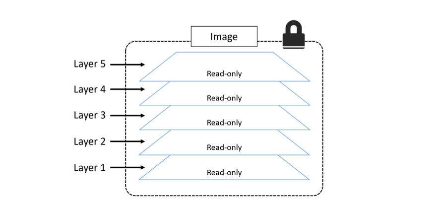
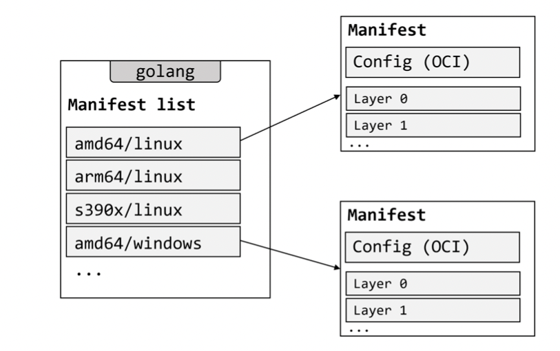
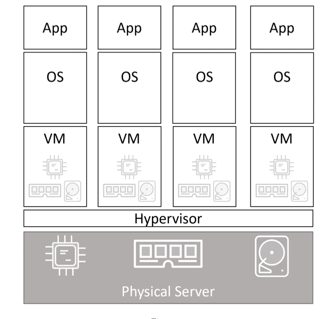
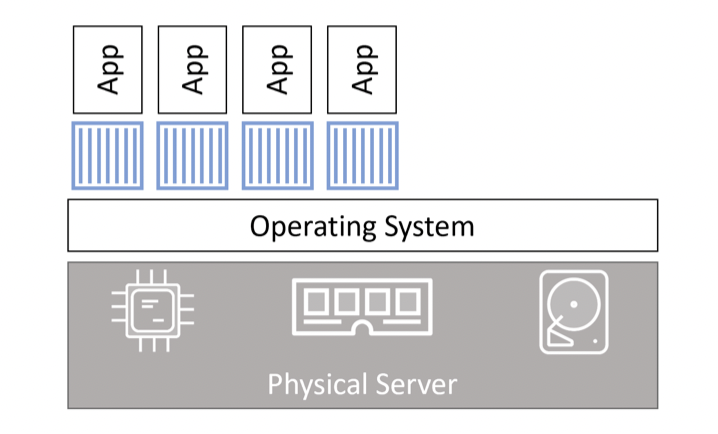

# Chapter 1 : Container from 30.000 feet

## The bad old days

Most applications run on servers. In the past we could only run one application per server.
Every time the business needed a new application, the IT department would buy a new server.
This resulted in over-powered servers operating as low as 5-10% of their potential capacity. A tragic waste of company
capital and environmental resources!

## Hello VMware!

This was a game changer. IT departments no longer needed to procure a brand-new oversized server every time the business
needed a new application. More often than not, they could run new apps on existing servers that were sitting around with
spare capacity.

## VMwarts

The fact that every VM requires its own dedicated operating system (OS) is a major flaw.
Every OS needs patching and monitoring.And in some cases, every OS requires a license. All of this results in wasted
time and resources.

VMs are slow to boot, and portability isn’t great — migrating and moving VM workloads between hypervisors and cloud
platforms is harder than it needs to be.

## Hello Containers!

A major difference is that containers do not require their own full-blown OS.
In fact, all containers on a single host share the host’s OS. This frees up huge amounts of system resources such as
CPU, RAM, and storage. It also reduces potential licensing costs and reduces the overhead of OS patching and other
maintenance.

Containers are also fast to start and ultra-portable.

## Linux Containers

Modern containers started in the Linux world and are the product of an immense amount of work from a wide variety of
people over a long period of time.

Some of the major technologies that enabled the massive growth of containers in recent years include; kernel namespaces,
control groups, union filesystems, and of course Docker.

## Hello Docker !

It’s enough to say that Docker was the magic that made Linux containers usable for mere mortals. Put another way,
Docker, Inc. made containers simple!

## Windows containers

Windows containers are available on the Windows desktop and Windows Server platforms.
The core Windows kernel technologies required to implement containers are collectively referred to as Windows
Containers.

## Windows containers vs Linux containers

It’s vital to understand that a running container shares the kernel of the host machine it is running on. This means
that a containerized Windows app will not run on a Linux-based Docker host, and vice-versa — Windows containers require
a Windows host, and Linux containers require a Linux host.

It is possible to run Linux containers on Windows machines. For example, Docker Desktop running on Windows has two modes
— “Windows containers” and “Linux containers”. Depending on your version of Docker Desktop, Linux container run either
inside a lightweight Hyper-V VM or using the Windows Subsystem for Linux (WSL). The WSL option is newer and the
strategic option for the future as it doesn’t require a Hyper-V VM and offers better performance and compatibility.

## What about Mac containers?

There is currently no such thing as Mac containers.
However, you can run Linux containers on your Mac using Docker Desktop. This works by seamlessly running your containers
inside of a lightweight Linux VM on your Mac.

## What about Kubernetes

Kubernetes is an open-source project out of Google that has quickly emerged as the de facto orchestrator of
containerized apps. That’s just a fancy way of saying Kubernetes is the most popular tool for deploying and managing
containerized apps.

Kubernetes uses Docker as its default container runtime — the low-level technology that pulls images and starts and
stops containers.

# Chapter 2: Docker

## Docker - The TLDR

Docker is software that runs on Linux and Windows. It creates, manages, and can even orchestrate containers.
Docker, Inc. is the company that created the technology and continues to create technologies and solutions that make it
easier to get the code on your laptop running in the cloud.

## The Docker Technology

When most people talk about Docker, they’re referring to the technology that runs containers. However, there are at
least three things to be aware of when referring to Docker as a technology:

- The runtime
- The daemon (a.k.a engine)
- The orchestrator

The runtime operates at the lowest level and is responsible for starting and stopping containers.
The low-level runtime is called "runc" and is the reference implementation of Open Containers Initiative (OCI)
runtime-spec.

The higher-level runtime is called conteinerd. 'containerd' does a lot more than 'runc'.
It manages the entire lifecycle of a container, including pulling images, creating network interfaces, and managing
low-level runc instances.

The Docker daemon (dockerd) sits above containerd and performs higher-level tasks such as; exposing the Docker remote
API, managing images , managing volumes, managing networks, and more...

## The Open Container Initiative (OCI)

The OCI is a governance council responsible for standardizing the low-level fundamental components of container
infrastructure.

https://opencontainers.org/

## Chapter summary

Docker, Inc. is a technology company out of San Francisco with an ambition to change the way we do software.
They were arguably the first-movers and instigators of the modern container revolution.

The Docker technology focuses on running and managing application containers. It runs on Linux and Windows,
can be installed almost anywhere, and is currently the most popular container runtime used by Kubernetes.

The Open Container Initiative (OCI) was instrumental in standardizing the container runtime format and container image
format.

# Chapter 3: Installing Docker

## Docker Desktop

Docker Desktop is a packaged product from Docker, Inc. It runs on 64-bit versions of Windows 10 and Mac, and it’s easy
to download and install.

Docker Desktop on Windows 10 can run native Windows containers as well as Linux containers. Docker Desktop on Mac can
only run Linux containers.

### Installing Docker Desktop on Mac

Docker Desktop for Mac is like Docker Desktop on Windows 10 — a packaged product from Docker, Inc with a simple
installer that gets you a single-engine installation of Docker that’s ideal for local development needs. You can also
enable a single-node Kubernetes cluster.

Docker Desktop on Mac doesn’t give you the Docker Engine running natively on the Mac OS Darwin kernel. Behind the
scenes, the Docker daemon is running inside a lightweight Linux VM that seamlessly exposes the daemon and API to your
Mac environment. This means you can open a terminal on your Mac and use the regular Docker commands.

Although this works seamlessly on your Mac, don’t forget that it’s Docker on Linux under the hood.
so it’s only going work with Linux-based Docker container.

docker version
Notice that the OS/Arch: for the Server component is showing as linux/amd64. This is because the daemon is running
inside of the Linux VM we mentioned earlier. The Client component is a native Mac application and runs directly on the
Mac OS Darwin kernel (OS/Arch: darwin/amd64).

# Chapter 4: The Big Picture

## The Ops Perspective

When you install Docker , you get two major components:

- the Docker client
- the Docker daemon

The daemon implements the runtime, API and everything else required to run Docker.
In a default Linux installation, the client talks to the daemon via a local IPC/Unix socket at /var/run/docker.sock.

### Images

It’s useful to think of a Docker image as an object that contains an OS filesystem, an application, and all application
dependencies.

In the Docker world, an image is effectively a stopped container. If you’re a developer, you can think of an image as a
class.

docker image ls

docker image pull ubuntu:latest
Run the docker image ls command again to see the image you just pulled.

docker images
It’s also worth noting that each image gets its own unique ID. When referencing images, you can refer to them using
either IDs or names. If you’re working with image ID’s, it’s usually enough to type the first few characters of the ID —
as long as it’s unique, Docker will know which image you mean.

### Containers

Now that we have an image pulled locally, we can use the docker container run command to launch a container from it.

docker container run -it ubuntu:latest /bin/bash
docker container run tells the Docker daemon to start a new container. The -it flags tell Docker to make the container
interactive and to attach the current shell to the container's terminal.

You can see all running containers on your system using the docker container ls command.

docker container ls

### Attaching to running containers

You can attach your shell to the terminal of a running container with the docker container exec command.

docker start hopeful_elion
docker container exec -it hopeful_elion bash
ps
The format of **docker container exec** is **docker container exec<options><container-name or container-id> <
/command/app>

Stop the container and kill it using the docker container stop and docker container rm commands. Remember to substitute
the names/IDs of your own containers.

docker container stop hopeful_elion
docker container rm hopeful_elion
Verify that the container was successfully deleted by running the docker container ls command with the -a flag. Adding
-a tells Docker to list all containers, even those in the stopped state.

docker container ls -a

## The Dev Perspective

Use the docker image build command to create a new image using the instructions in the Dockerfile.

docker image build -t test:latest .

docker container run -d
--name web1
--publish 8080:8080
test:latest

# Chapter 5 : The Docker Engine

## Docker Engine - The TLDR

The Docker engine is the core software that runs and manages containers.

The Docker engine is modular in design and built from many small specialised tools. Where possible, these are based on
open standards such as those maintained by the Open Container Initiative (OCI).

The major components that make up the Docker engine are; the Docker daemon, containerd, runc, and various plugins such
as networking and storage.

## Docker Engine - The Deep Dive

When Docker was first released, the Docker engine had two major components:

- The Docker daemon
- LXC

The Docker daemon was a monolithic binary. It contained all of the code for the Docker client, the Docker API, the
container runtime, image builds, and much more.

LXC provided the daemon with access to the fundamental building-blocks of containers that existed in the Linux kernel.
Things like namespaces and control groups. (cgroups)

### Getting rid of LXC

LXC is Linux-specific. This was a problem for a project that had aspirations of being multi-platform.

As a result, Docker. Inc. developed their own tool called **libcontainer** as a replacement for LXC. The goal of
**libcontainer** was to be a platform-agnostic tool that provided Docker with access to the fundamental container
building-blocks that exist in the host kernel.

### Getting rid of the monolithic Docker daemon

The monolithic nature of the Docker daemon became more and more ploblematic:

- It's hard to innovate on
- It got slower.
- It wasn't what the ecosystem wanted.

This work of breaking apart and re-factoring the Docker engine has seen all of the container execution and container
runtime code entirely removed from the daemon and refactored into small, specialized tools.

### The influence of the Open Container Initiative (OCI)

While Docker, Inc was breaking the daemon apart and refactoring code, the OCI was in the process of defining two
container-related specifications;

- Image spec
- Container runtime spec

The Docker engine implements the OCI specifications as closely as possible.

### runc

The **runc** is the reference implementation of the OCI container-runtime spec.
runc has a single purpose in life - create containers.

### containerd

All of the container execution logic was ripped out and refactored into a new tool called **containerd**.
Its sole purpose in life was to manage container lifecycle operations -start | stop | pause | rm ...

In the Docker engine stack , containerd sits between the daemon and runc at the OCI layer.

**containerd** was originally intended to be small, lightweight, and designed for a single task in life - container
lifecycle operations.However, over time it has branched out and taken on more functionality. Things like image pulls,
volumes and networks.

### Starting a new container

The following docker container run command will start a simple new container based on the alpine:latest image.

docker container run --name ctr1 -it alpine:latest sh
When you type commands like this into the Docker CLI , the Docker clients converts them into the appropriate API payload
and POSTs them to the API endpoint exposed by the Docker daemon.

One the daemon receives the command to create a new container, it makes a call to containerd.
The daemon communicates with container via a CRUD-style API over gRPC.

Despite its name, **containerd** cannot actually create containers. It uses **runc** to do that. It converts the
required Docker image into an OCI bundle and tells runc to use this to create a new container.

runc interfaces with the OS kernel to pull together all of the constructs necessary to create a container.

### One huge benefit of this model

Having all of the logic and code to start and manage containers removed from the daemon means that the entire container
runtime is decoupled from the Docker daemon.

In the old model, where all of container runtime logic was implemented in the daemon, starting and stopping the daemon
would kill all running containers on the host. This was a huge problem in production environments

Fortunately, this is no longer a problem.

### What's this shim all about ?

The shim is integral to the implementation of daemonless containers.

**containerd** uses **runc** to create new containers. In fact, it forks a new instance of runc for every container it
creates. However, once each container is created, the parent runc process exits. This means we can run hundreds of
containers without having to run hundreds of runc instances.

### How it’s implemented on Linux

The components we've discussed are implemented as separate binaries as follows:

- dockerd (The Docker daemon)
- docker-containerd(containerd)
- docker-container-shim(shim)
- docker-runc(runc)

### What's the point of the daemon

At the time of writing, some of the major functionality that still exists in the daemon includes; image
management, image builds, the REST API, authentication, security, core networking, and orchestration.

## Securing client and daemon communication

Docker implements a client-server model.

- The client component implements the CLI
- The server(daemon) component implements the functionality, including the public-facing REST API.

By default, network communication occur over an unsecured HTTP socket on port 2375/tcp

Docker lets you force the client and daemon to only accept network connections that are secured with TLS. This is
recommended for production environments, even if all traffic is traversing trusted internal networks.

## Chapter summary

The Docker engine is modular in design and based heavily on open-standards from the OCI.
The Docker daemon implements the Docker API which is currently a rich, versioned, HTTP API that has developed alongside
the rest of the Docker project.

Container execution is handled by **containerd.** You can think of it as a container supervisor that handles container
lifecycle operations. It is small and lightweight and can be used by other projects and third-party tools.

containerd needs to talk to an OCI-compliant container runtime to actually create containers. By default, Docker uses
runc as its default container runtime. runc is the de facto implementation of the OCI runtime-spec and expects to start
containers from OCI-compliant bundles.
containerd talks to runc and ensures Docker images are presented to runc as OCI-compliant bundles.

runc can be used as a standalone CLI tool to create containers. It’s based on code from libcontainer, and can also be
used by other projects and third-party tools.

There is still a lot of functionality implemented in the Docker daemon. More of this may be broken out over time.
Functionality currently still inside of the Docker daemon includes, but is not limited to; the Docker API, image
management, authentication, security features and core networking.

# Chapter 6 Images

## Docker images - The TLDR

A Docker image is a unit of packaging that contains everything required for an application to run. This includes;
application code , application dependencies, and OS constructs.

If you are a former VM admin, you can think of Docker images as similar to VM templates.
A VM template is like a stopped VM.
A Docker image is like a stopped container. If you are a developer you can think of them as similar to class.

You can get Docker images by pulling them from an image registry.

Images are made up multiple layers that are stacked on top of each other and represented as a single object.

## Docker images - The deep dive

### Images and containers

We use the **docker container run** and **docker service create** commands to start one or more containers from a single
image. Attempting to delete an image without stopping and destroying all containers using it will result in an error.

### Images are usually small

The whole purpose of a container is to run a single application or service. This means it only need to code and
dependencies of the app/service it is running - it does not need anything else.

### Pulling images

docker image pull redis:latest
...
docker image pull alpine:latest
...
docker image ls

### Image registries

We store images in centralised places called image registries. This makes it easy to share and access them.
The most common registry is Docker Hub (https://hub.docker.com)

docker info
.....
.....
Registry: https://index.docker.io/v1/
....

### Official and unofficial repositories

Docker Hub has the concept of official repositories and unofficial repositories.

Official repositories are the home to images that have been vetted and curated by Docker.
Unofficial repositories can be like the wild-west — you should not assume they are safe, well-documented or built
according to best practices.

### Image naming and tagging

The format for **docker image pull** when working with an image from an official repository is :

docker image pull <repository>:<tag>

docker image pull alpine:latest
docker image pull redis:latest
If you do not specify an image tag after the repository name, Docker will assume you are referring to the image tagged
as **latest**. If the repository doesn't have an image tagged as **latest** the command will fail.

Second, the latest tag doesn’t have any magical powers. Just because an image is tagged as latest does not guarantee it
is the most recent image in a repository.

Pulling images from an unofficial repository is essentially the same — you just need to prepend the repository name with
a Docker Hub username or organization name.

If you want to pull images from 3rd party registries (not Docker Hub), you need to prepend the repository name with the
DNS name of the registry.

docker image pull gcr.io/google-containers/git-sync:v3.1.5

### Images with multiple tags

A single image can have as many tags as you want.

Pull all of the images in a repository by adding the -a flag to the docker image pull command. Then run docker image ls
to look at the images pulled.

docker image pull -a nigelpoulton/tu-demo
docker image ls

nigelpoulton/tu-demo latest c610c6a38555 11 months ago 58.1MB
nigelpoulton/tu-demo v2 c610c6a38555 11 months ago 58.1MB
nigelpoulton/tu-demo v1 6ba12825d092 11 months ago 58.1MB
nigelpoulton/tu-demo v2-old d5e1e48cf932 2 years ago 104MB
nigelpoulton/tu-demo v1-old 6852022de69d 2 years ago 104MB
You will see that two of the IDs match. This is because two of the tags refer to the same image. Put another way, one of
the images has two tags.

Moral of the story, latest is an arbitrary tag and is not guaranteed to point to the newest image in a repository!

### Filtering the output of docker image ls

Docker provides the -- filter flag to filter the list of images returned by docker image ls.

docker image ls --filter dangling=true
A dangling image is an image that is no longer tagged, and appears in listings as < none >:< none >. A common way they
occur
is when building a new image giving it a tag that already exists. When this happens, Docker will build the new image,
notice that an existing image already has the same tag, remove the tag from the existing image and give it to the new
image.

You can delete all dangling images on a system with the docker image prune command. If you add the -a flag Docker
will also remove all unused images. (those not in use by any containers.)

- dangling : Accepts true or false , and returns only dangling images (true) , or non-dandling images (false).
- before : Requires an image name or ID as argument , and returns all images created before it.
- since : Same as above, but returns images created after the specified image.
- label : Filters images based on the presence of a label or label and value. The docker image ls command does not
  display labels in its output.

Here is an example ;

docker image ls --filter=reference="*:latest"
You can also use the --format flag to format output ;

docker image ls --format "{{.Size}}"
docker image ls --format "{{.Repository}}: {{.Tag}}: {{.Size}}"

### Searching Docker Hub from the CLI

The docker search command lets you search Docker Hub from the CLI. This has limited value as you can only pattern-match
against strings in the “NAME” field.

docker search leventerguder
...
docker search nigelpoulton
....
docker search alpine
You can use --filter "is-official=true" so that only official repos are displayed.

docker search alpine --filter "is-official=true"
By default, Docker will only display 25 lines of results. However, you can use the --limit flag to increase that to a
maximum of 100.

### Images and Layers

A Docker image is just a bunch of loosely-connected read only layers, with each layer comprising one or more files.

Docker takes care of stacking these layers and representing them as a single unified object.
All Docker images start with a base layer , and as changes are made and new content is added, new layers are added on
top.

It is important to understand that as additional layers are added, the image is always the combination of all layers
stacked in the order they were added.

### Sharing image layers

Multiple images can , and do, share layers. This leads to efficiencies in space and performance.
Docker is smart enough to recognize when it’s being asked to pull an image layer that it already has a local copy of.

### Pulling images by digest

Tags are mutable. This means it's possible to accidentally tag an image with the wrong tag. Sometimes, it’s even
possible to tag an image with the same tag as an existing, but different, image. This can cause problems!

Docker 1.10 introduced a content addressable storage model. As part of this model, all images get a cryptographic
content hash. You cannot change the content of an image and keep the old digest.

This means digests are immutable and provide a solution to the problem we just talked about.

Every time you pull an image, the docker image pull command includes the image’s digest as part of the information
returned.

    docker image ls --digests alpine
    docker image rm alpine:latest
    docker image pull alpine@sha256:686d8c9dfa6f3ccfc8230bc3178d23f84eeaf7e457f36f271ab1acc53015037c

### A little bit more about image hashes (digests)

Each images is identified by a crypto ID that is a hash of the config file. Each layer is identified by a crypto ID that
is a has of the layer content. We call these "content hashes".

This means that changing the content of the image, or any of its layers, will cause the associated crypto hashes to
change. As a result, images and layers are immutable, and we can easily identify any changes made to either.

Each layer also gets something called a distribution hash.

As well as providing a cryptographically verifiable way to verify image and layer integrity, it also avoids ID
collisions that could occur if image and layer IDs were randomly generated.

### Multi-architecture images

We’re using the term “architecture” to refer to CPU architecture such as x64 and ARM. We use the term “platform” to
refer to either the OS (Linux or Windows) or the combination of OS and architecture.

Docker and Docker Hub have a slick way of supporting multi-arch images.
Docker will pull the correct image for your platform and architecture.

To make this happen, the Registry API supports two important constructs:

- manifest lists
- manifests

The manifest list is exactly what is sounds like: a list of architectures supported by a particular image tag. Each
supported architecture then haas its own *manifest detailing the layers that make it up.

We do not have to tell Docker that we need the Linux or Windows version of image. We just run normal commands and let
Docker take care of getting the right image for the platform and architecture we are running.

    docker container run --rm golang go version
    ....
    go version go1.18.3 linux/arm64

All official images have manifest lists.
You can create your own builds for different platforms and architectures with docker buildx and then use docker manifest
create to create your own manifest lists.

    docker manifest inspect redis

### Deleting Images

Deleting an image will remove the image and all of its layers from your Docker host.

    docker image rm <image-name> | <image-id>

If the image you are trying to delete is in use by a running container you will not be able to delete it. Stop and
delete any containers before trying the delete operation again.

A handy shortcut for deleting all images on a Docker host is to run the docker image rm command and pass it a list of
all image IDs on the system by calling docker image ls with the -q flag.

    docker image rm $(docker image ls -q) -f

## Images - The commands

- docker image pull is the command to download images. We pull images from repositories inside of remote registries.
- docker image ls lists all of the images stored in your Docker host's local image cache.
- docker image inspect gives you all of the glorious details of an image.
- docker manifest inspect , allows you to inspect the manifest list of any image stored on Docker Hub
- docker buildx is a Docker CLI plugin that extends the Docker CLI to support multi-arch builds.
- docker image rm is the command to delete images.

# Chapter 7 : Containers

## Docker Containers - The TLDR

A container is the runtime instance of an image. In the same way that you can start a virtual machine (VM) from a
virtual machine template, you start one or more containers from a single image. The big difference between a VM and a
container is that containers are faster and more lightweight.

    docker container run -it ubuntu /bin/bash

The -it flags will connect your current terminal window to the container's shell.

The container will start, seize your terminal for 10 seconds, then exit. The following is a simple way to demonstrate
this on a Linux Docker host.

    docker container run -it alpine:latest sleep 10

You can manually stop a running container with the **docker container** stop command. You can then restart it with
**docker container start**
To get rid of container forever , **docker container rm**.

## Docker Containers - The deep dive

### Containers vs VMs

Containers and VMs both need a host to run.
Let’s assume a requirement where your business has a single physical server that needs to run 4 business applications.

Assuming the scenario of a single physical server that needs to run 4 business applications, we’d create 4 VMs, install
4 operating systems, and then install the 4 applications.

On top of the OS, we install a container engine such as Docker. The container engine then takes OS resources such as the
process tree, the filesystem, and the network stack, and carves them into isolated constructs called containers. Each
container looks smells and feels just like a real OS. Inside of each container we run an application.

If we assume the same scenario of a single physical server needing to run 4 business applications, we’d carve the OS
into 4 containers and run a single application inside each.

At a high level, hypervisors perform hardware virtualization , they carve up physical hardware resources into virtual
versions called VMs. On the other hand, containers perform OS virtualization , they carve OS resources into virtual
versions called containers.

### The VM tax

The VM model carves low-level hardware resources into VMs. Each VM is a software construct containing virtual CPUs,
virtual RAM, virtual disks etc.As such, every VM needs its own OS to claim, initialize, and manage all of those virtual
resources. And sadly, every OS comes with its own set of baggage and overheads.

The container model has a single OS/kernel running on the host. It's possible to run tens or hundreds of containers on a
single host with every container sharing that single OS/kernel.
That means a single OS consuming CPU, RAM and storage. A single OS that needs licensing. A single OS that needs updating
and patching. And a single OS kernel presenting an attack surface. All in all, a single OS tax bill!

That might not seem a lot in our example of a single server running 4 business applications. But when you start talking
about hundreds or thousands of apps, it becomes a game-changer.

Another thing to consider is application start times. As a container isn’t a full-blown OS, it starts much faster than a
VM.

You can pack more applications onto less resources, start them faster, and pay less in licensing and admin costs, as
well as present less of an attack surface to the dark side.

Well, one thing that’s not so great about the container model is security. Out of the box, containers are less secure
and provide less workload isolation than VMs.

### Starting a simple container

The simplest way to start a container is with the **docker container run** command.

    docker container run -it ubuntu:latest /bin/bash

The **docker container run** tels Docker to run a new container. The -if flags make the container interactive and attach
it to your terminal.

Once the image was pulled , the daemon instructed containerd and runc to create and start the container.

### Container processes

When we started the Ubuntu container , this makes the Bash shell the one and only process running inside of the
container.
Killing the main process in the container will kill the container.

Press Ctrl-PQ to exit the container without terminating its main process.

    docker container ls

It's important to understand that this container is still running and you can re-attach your terminal to it with the
docker container exec command.

    docker container exec -it <container-id> bash

If you are following along with the examples, you should stop and delete the container with the following two commands.

    docker container stop <container-id>
    docker container rm <container-id>
